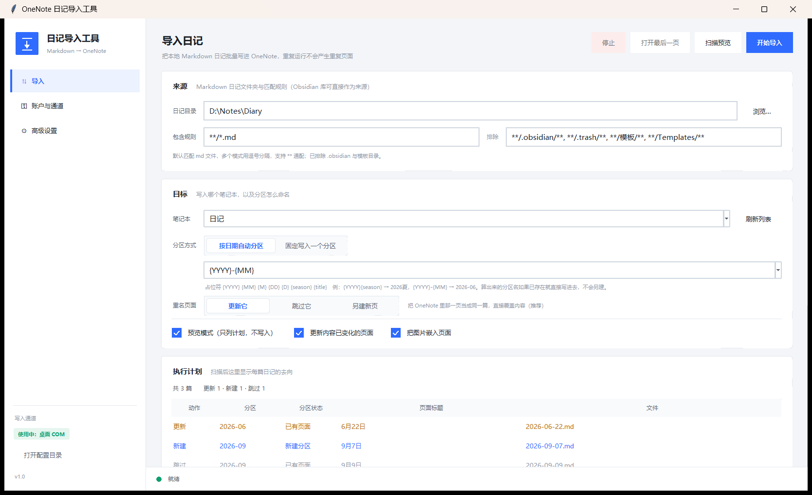
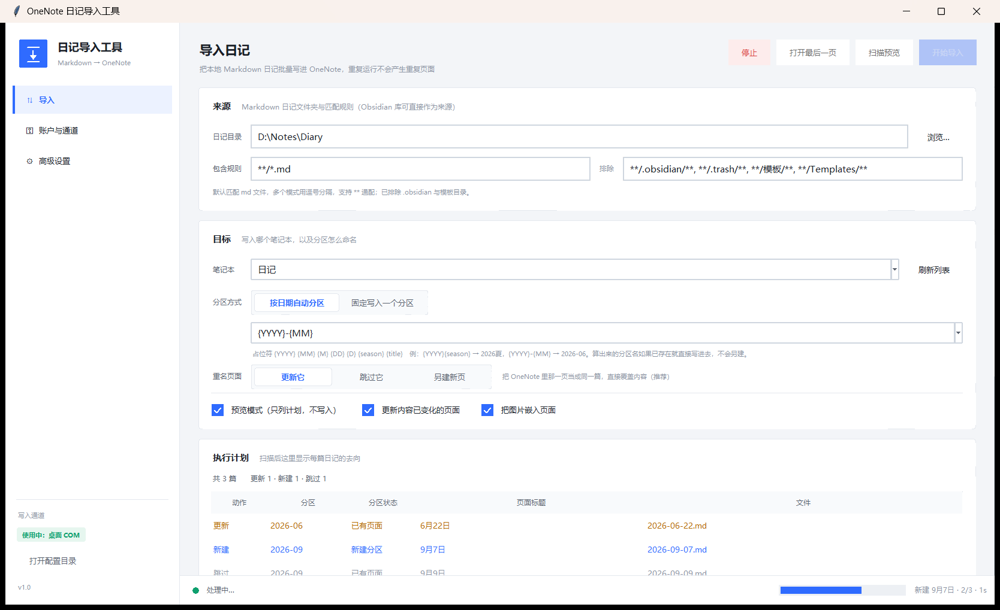
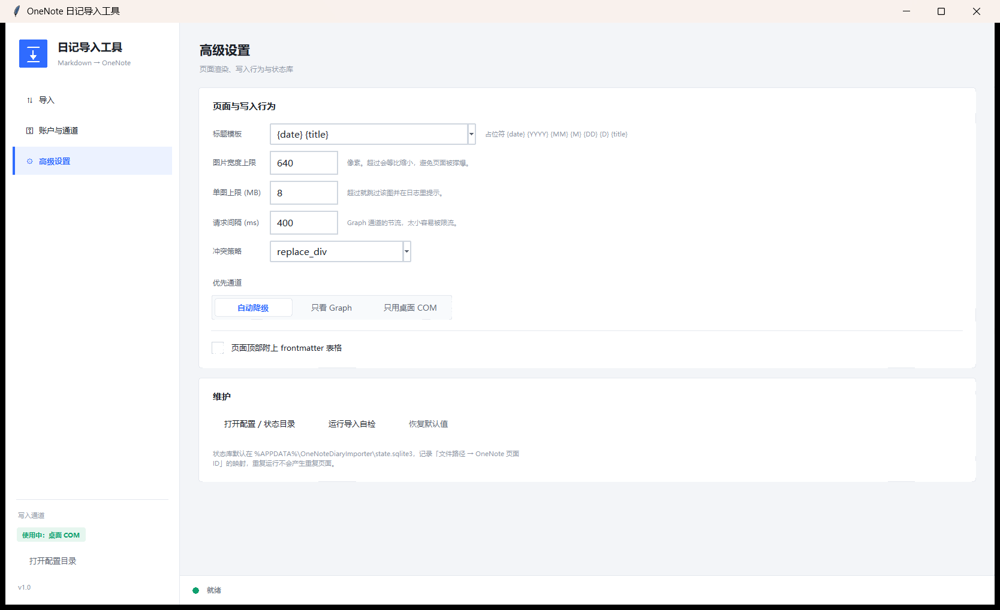

# OneNote 日记导入工具

把本地 Markdown 日记批量导进 OneNote 的 Windows 小工具。日记只要是 md 文件就能用，Obsidian 的库可以直接选作来源。

除了 Python 和 OneNote，不用装别的东西，也没有 pip 依赖。



*Batch-import local Markdown diaries into OneNote. Windows, Python 3.10–3.13, no pip dependencies — [English](#english)*

## 安装

1. 装 Python，版本在 3.10 到 3.13 之间，用 python.org 的官方安装包。安装界面里有两项要勾上：Add python.exe to PATH、还有 Tcl/Tk and IDLE。后面这个是 tkinter，不勾的话界面起不来。
2. 本机要有桌面版 OneNote。Microsoft Store 里那个应用版本没有 COM 接口，用不了，得是 Office 带的桌面版。

下载下来解压到哪都行，不用安装，目录里已经有 run.bat。

## 使用

双击 run.bat，它会自己找一个带 tkinter 的 Python 把界面打开。要是没找到，黑窗口里会写明原因，不会一闪就没了。想看完整报错就用 run-console.bat，它会把控制台留着。

第一次用建议按这个顺序走：

1. 在「导入」页选好日记目录，点扫描预览。这一步不碰 OneNote，只是先告诉你哪些文件会被导入、分别进哪个分区。
2. 看一眼列表，确认没选错。想先拿一篇试水，就把包含规则临时改成 `**/2026-09-07.md`。
3. 确认完，到「目标」卡里取消勾选预览模式，再点开始导入。

同步的时候右下角会显示进度和当前正在写哪一篇：



预览模式默认是勾上的，勾着的时候跑多少遍都不会动 OneNote，日志和界面上都会写明这次只是预览。

分区默认按年月命名，9 月的日记进「2026-09」。模板可以改，也支持按年加季节那种写法。算出来的分区名如果 OneNote 里已经有了，就直接写进去，不会另建一个。

同一批日记重复导入不会产生重复页面。程序在 `%APPDATA%\OneNoteDiaryImporter\state.sqlite3` 里记着每个文件的内容指纹和对应的页面 ID，内容没变就跳过，变了就更新原来那一页。

### 两条写入通道

启动时自动挑一条可用的：

- 桌面版 OneNote 的 COM 接口。装了桌面版 OneNote 就能用，不需要任何配置。
- Microsoft Graph 云通道。需要自己到 Azure 上注册一个应用，把客户端 ID 填进「账户与通道」页，然后设备码登录一次。写进的是云端笔记本，手机上也看得到。

不想碰 Azure 就在「高级设置」里把优先通道改成「只用桌面 COM」。



### 命令行

界面里能做的，命令行也能做，方便挂到任务计划程序里定时跑：

```bat
python cli.py probe                            看哪个通道能用
python cli.py plan  --vault D:\Notes           预览计划，不写 OneNote
python cli.py sync  --apply --vault D:\Notes   真正写入
```

## 联系

用出问题，或者有想法想聊，发邮件给我：liam.zhong@foxmail.com

## English

A small Windows tool that batch-imports local Markdown diaries into OneNote. Any folder of `.md` files works, and an Obsidian vault can be pointed at directly. No pip dependencies — you only need Python 3.10–3.13 and desktop OneNote.

**Install.** Get Python from python.org and tick *Add python.exe to PATH* plus *Tcl/Tk and IDLE* (that second one is tkinter, without it the window won't start). You also need the desktop version of OneNote — the Microsoft Store app has no COM interface. Unzip anywhere, there is nothing to install.

**Use.** Pick your diary folder and hit the scan button first: it only prints what would happen and does not touch OneNote. Untick preview mode and start the import when the plan looks right. Repeated runs are safe — each file is fingerprinted, unchanged ones are skipped, and a changed file updates its existing page instead of creating a second one.

The interface is Chinese-only for now. Questions and bug reports: liam.zhong@foxmail.com
