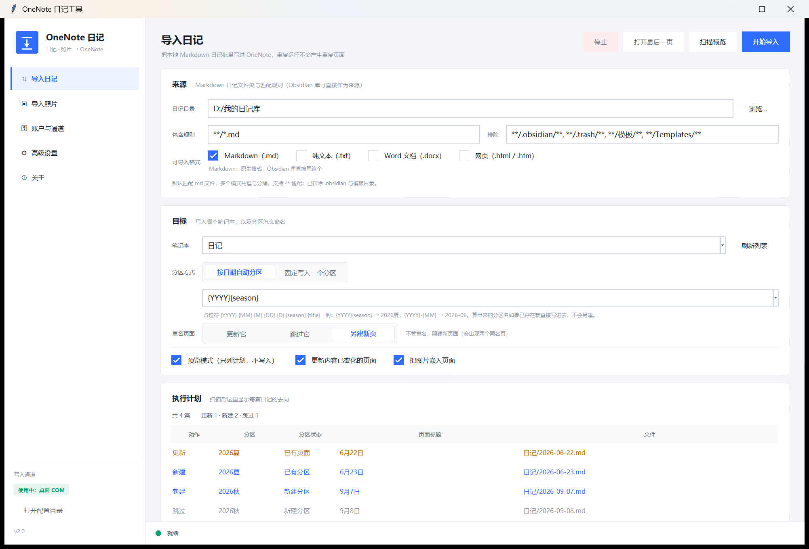
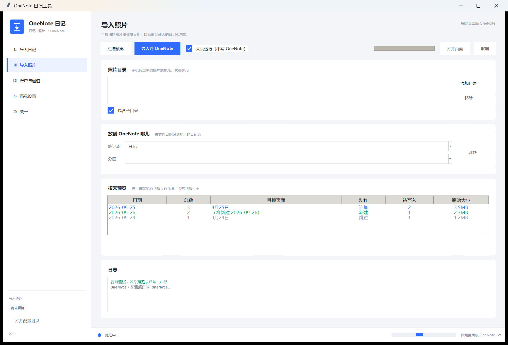
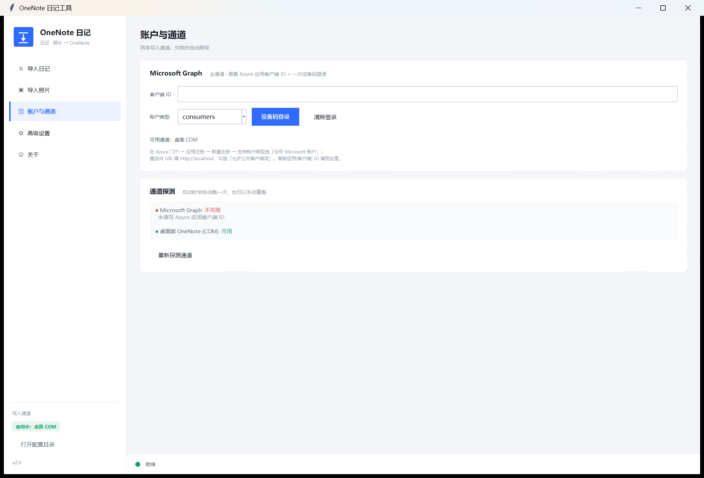
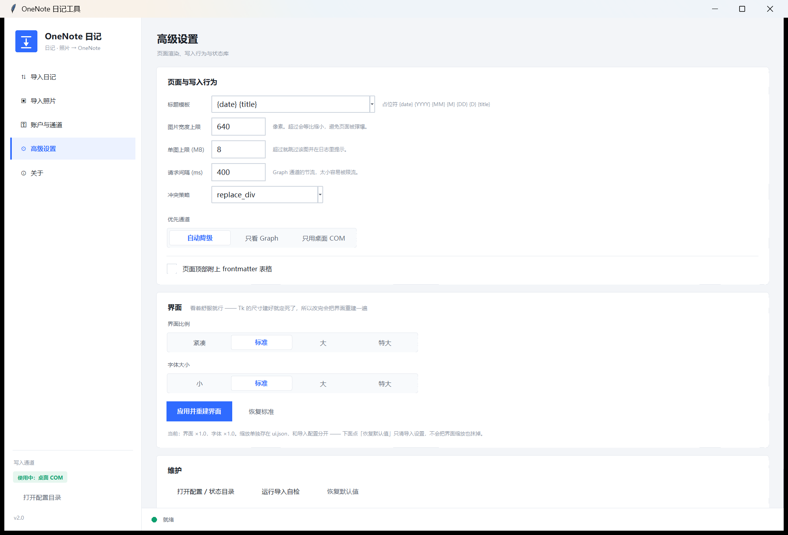
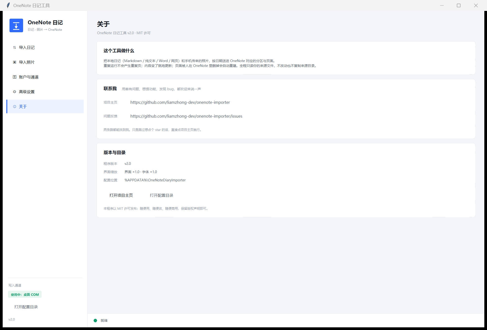

# OneNote 日记工具

把本地的东西批量送进 OneNote，两条链路共用**一个程序**：

| 页面 | 做什么 |
|---|---|
| **导入日记** | 把本地 **Markdown 日记**批量导入 OneNote：一次配置，之后点两下就跑完，重复运行不会产生重复页面。 |
| **导入照片** | 把手机传过来的照片**按拍摄日期**分好组，追加到那天的日记页末尾。 |
| **账户与通道** | 看每条写入通道通不通、配置 Graph 登录。 |
| **高级设置** | 标题模板、图片上限、界面比例等偏底层的选项。 |
| **关于** | 版本、许可与联系方式。 |

只要日记是 md 文件就适用——**Obsidian 库可以直接选作来源**，其它工具导出的 Markdown 同样能导入。
除 Markdown 外还支持三种「简单格式」，在「导入日记」页的**可导入格式**里勾选：

| 格式 | 怎么读进来的 | 说明 |
|---|---|---|
| **Markdown**（.md / .markdown） | 原样 | 原生格式，Obsidian 库直接用这个 |
| **纯文本**（.txt） | 自动探测编码（UTF-8 / UTF-16 / GB18030） | 记事本、备忘录导出的；不加任何语法标记 |
| **Word**（.docx） | zipfile + xml 直读，零依赖 | 标题 / 加粗 / 列表 / 表格 / 超链接 / 配图都认；配图会抽出来一起嵌进页面 |
| **网页**（.html / .htm） | 标准库 html.parser 取正文 | 浏览器「另存为网页」的结果；script / style / nav / footer 会被丢掉 |

> **不支持** `.doc`（97-2003 的老二进制格式）、`.pdf`、`.rtf`。这几个要么得装第三方库，
> 要么得外调 Word/WPS 进程 —— 硬做出来的稳定性还不如不做。`.doc` 直接改后缀成 `.docx` 也认不出来，
> 会在计划里标成「读取失败」并说明原因，不会悄悄生成一个空白页。

**零 pip 依赖**：HTTP 走标准库 `urllib`，OneNote 桌面自动化走 PowerShell COM，界面用 Python 自带的 `tkinter`。不需要 `pip install` 任何东西（官方 Python 自带 tkinter）。

---

## 界面

**导入日记** —— 选好目录先「扫描预览」（只读，不写 OneNote），确认没选错再真正写入：



**导入照片** —— 手机传过来的照片按拍摄日期分组，追加到那天的日记页末尾：



**账户与通道** —— 看桌面 COM / Microsoft Graph 两条链路通不通，配 Graph 登录：



**高级设置** —— 标题模板、分区命名、写入行为、界面缩放：



**关于** —— 版本、许可与联系方式：



---

## 1. 快速开始

### 1.1 用 exe 启动（推荐）

不想装 Python 的话，直接去 [Releases](https://github.com/liamzhong-dev/onenote-importer/releases) 下载打包版，解压后双击 `OneNote日记工具.exe` —— 没有控制台黑窗，双击就是界面。第一次打开 Windows 可能会拦一下，点「更多信息 → 仍要运行」：这个 exe 没有买代码签名，属于正常提示。

自己打的话用 `pack_exe.py`：

```bat
python pack_exe.py             :: 打包 + 自动验证
python pack_exe.py --clean     :: 先清掉 build/ 和 dist/ 再打
```

产物在 `dist\OneNote日记工具\`，**整个文件夹一起拷**就能分发（不是单文件）。
打完会自动验三件事：桥脚本进没进包、真启动一次进程活不活、**枚举该进程的窗口断言没有控制台黑窗**。

> 用的是 onedir 而不是 onefile：onefile 每次启动都要把整包解压到临时目录，冷启动好几秒；onedir 是秒开。

### 1.2 用 Python 启动（改代码时用）

```bat
双击 run.bat               :: 自动挑一台带 tkinter 的 Python 再启动
python app.py              :: 同上
python app.py --selftest   :: 不需要 OneNote 和任何凭据，先跑一遍自检
```

> `run.bat` 会**自动挑一台带 tkinter 的 Python**：先试本目录 `.venv`，再依次试常见安装路径，最后才用 PATH 里的 `python`，逐个执行 `import tkinter` 验证。找到之后会先跑一遍依赖自检再启动——所以就算失败，黑窗口里也会告诉你原因，不会再"一闪而过"。
>
> 如果双击后还是没反应：运行 `run-console.bat`，它会保留控制台窗口，把错误原样打出来。

### 1.3 第一次用

1. 打开界面，在「**导入日记**」页选好 **日记目录**，点 **扫描预览**——这一步只会**读** OneNote（看分区在不在、有没有同名页、记忆里的页面还在不在），**不写任何东西**；
2. 确认列表没问题后，取消勾选「预览模式」，点 **开始导入**。

第一次真跑建议只留一篇测试：把「包含规则」临时改成 `**/2026-09-07.md`，确认效果再放开全量。

**装了别的格式的话，用「可导入格式」那排勾选框开关，不用去改「包含规则」。**
`包含规则` 只管**目录层级**，后缀筛选完全由勾选框决定——所以里面那条默认的 `**/*.md`
在你勾上 txt 之后不会把 `.txt` 挡掉（匹配前会把 glob 末尾的来源后缀摘掉，见 `core/scanner.py`）。

照片那条链路同理：在「**导入照片**」页选好照片目录，先点 **扫描预览** 看「按天预览」怎么分组，再点 **导入到 OneNote**。全程勾着「先试运行（不写 OneNote）」更稳妥。

> 照片页的 OneNote 连接是**懒加载**的：启动时不会去连，等你真的切到那一页才开始探测通道，所以不会拖慢开程序。

### 1.4 界面比例与字体大小

字太小、屏幕太远的时候，在「**高级设置** → **界面**」里调：

| 档位 | 界面比例 | 字体大小 |
|---|---|---|
| 可选值 | 紧凑 0.85 / 标准 1.0 / 大 1.15 / 特大 1.3 | 小 0.9 / 标准 1.0 / 大 1.15 / 特大 1.3 |

两档是**分开**的：只把字调大、控件不变大，或者反过来，都可以。选好点 **应用并重建界面** 生效（点 **恢复标准** 回到 1.0）。

> 为什么要"重建"：Tk 控件的尺寸在创建时就定死了，改缩放只能把界面整个推倒重搭一遍。
> 重建会保留当前配置和日志，只是闪一下。
>
> 设置存在 `%APPDATA%\OneNoteDiaryImporter\ui.json`，**故意和 `config.json` 分开**——
> 它是"这台机器上看着舒服"的显示设置，跟导入业务无关，所以在「维护」里点「恢复默认值」时不会把缩放一起抹掉。
>
> 另外这只是**在系统 DPI 之上再乘一层**。系统本身 150% 缩放的话，就算这里选「标准」，
> 实际尺寸也是 1.5 倍——在 150% 屏幕上选「特大」等于 1.95 倍，窗口可能会顶到屏幕边缘。

---

## 2. 两条写入通道（自动降级）

| | Graph REST（主通道） | OneNote 桌面 COM（备通道） |
|---|---|---|
| 写入位置 | 云端笔记本，手机上也能看 | 本机桌面版 OneNote 能访问的笔记本 |
| 前置条件 | Azure 免费注册一个应用 + 设备码登录一次 | 本机装了**桌面版** OneNote（不是应用商店 UWP 版） |
| 图片 | multipart 二进制部件嵌入 | base64 嵌入 `<one:Image>` |
| 附件（PDF 等） | `<object data-attachment>` 嵌入 | 暂不支持，降级为占位提示 |
| 自动建笔记本/分区 | 支持 | 支持 |

程序启动时按 `优先通道` 设置探测：**Graph 失败自动切 COM**。界面「账户与通道」页会列出每条通道可用 / 不可用以及原因。

### 2.1 配置 Graph（一次性）

1. 打开 https://portal.azure.com → **应用注册** → **新注册**；
2. 名称随便填（例如 `OneNoteDiaryImporter`），受支持的账户类型选 **「任何 Microsoft 账户目录中的个人 Microsoft 账户」**；
3. 重定向 URI：选择 **公共客户端/本机(移动与桌面)**，填 `http://localhost`；
4. 注册完后，在应用的 **概览** 页复制 **应用程序(客户端) ID**；
5. 回到本程序的「账户与通道」页，粘进 **客户端 ID**，点 **设备码登录**，按提示在浏览器里输入验证码即可。

> 用的是 **设备码流**，不需要在 Azure 里填任何密钥（client secret），也不需要开任何付费服务。
> 登录后 refresh token 存在 `%APPDATA%\OneNoteDiaryImporter\token.json`，之后静默续期，不必反复登录。
> 权限范围只有 `Notes.ReadWrite`、`Notes.Create`、`User.Read`、`offline_access`——读不到你的邮件和文件。

如果你完全不想碰 Azure，就在「高级设置」页把 **优先通道** 改成「只用桌面 COM」，本机有桌面版 OneNote 就能直接用。

---

## 3. 归档规则

### 3.1 分区：两种方式

「导入」页的 **分区方式** 决定日记往哪个分区里放：

| 方式 | 说明 |
|---|---|
| **按日期自动分区** | 每篇日记按自己的日期套模板算出分区名。比如模板 `{YYYY}{season}`，6 月的日记就进 `2026夏`。 |
| **固定写入一个分区** | 所有日记都写进你指定的那一个分区，从下拉里挑一个已有的。 |

> **关键**：算出来的分区名如果 OneNote 里**已经有了，就直接写进去**，新页面接在原有页面后面——**不会另建一个分区**。
> 名字比对忽略大小写与首尾空格，所以「2026夏」和「2026 夏 」算同一个。
> 计划表里的「分区状态」列会明确标出这一篇是「已有分区」（复用）还是「新建分区」。

### 3.2 分区名模板占位符

| 占位符 | 含义 | 示例（2026-06-22） |
|---|---|---|
| `{YYYY}` | 日期所在年 | `2026` |
| `{MM}` / `{M}` | 月（补零 / 不补零） | `06` / `6` |
| `{DD}` / `{D}` | 日（补零 / 不补零） | `22` / `22` |
| `{season}` | 中文季节，春 3–5 / 夏 6–8 / 秋 9–11 / 冬 12–2 | `夏` |
| `{season_year}` | 冬天跨年时归到「冬天开始的那一年」 | 2026-01 → `2025` |
| `{YYYY}-{MM}` | 便捷写法，等价于 `{YYYY}-{MM}` | `2026-06` |
| `{title}` | 笔记标题 | `晨跑` |

常用组合：`{YYYY}{season}` → `2026夏`；`{YYYY}年{MM}月` → `2026年06月`；`{YYYY}-{MM}` → `2026-06`。

> `{YYYY}` 取的是**那一天所在的自然年**：2026-01-05 是 `2026冬`。
> 若你习惯把 1、2 月算进上一年的冬天，用 `{season_year}` 就得到 `2025冬`。

### 3.3 分区里已经有同名页面

日记目录里重跑导入、或者你自己也在 OneNote 里写过同一篇时，「重名页面」三选一：

| 选项 | 行为 |
|---|---|
| **更新它**（默认） | 当成同一篇，就地覆盖内容，页面位置和 page id 都不变——不会出现两个「9月7日」 |
| **跳过它** | 保留 OneNote 里那份，这一篇不动也不重复建 |
| **另建新页** | 不管重名，照建新页面（会出现两个同名页） |

### 3.4 页面标题

默认 `{date} {title}`，在「高级设置」页可改。占位符与分区模板一致，另有：

| 占位符 | 含义 | 示例 |
|---|---|---|
| `{date}` | 完整日期 | `2026-09-07` |
| `{M}月{D}日` | 中文「月日」写法 | `9月7日` |

如果你在 OneNote 里的既有命名是「9月7日」这种，就把标题模板改成 `{M}月{D}日`，新旧页面命名才能对得上、才会被认成同一篇。

日期取值优先级：frontmatter 的 `date/created/day` → 文件名里的 `2026-09-07` → 文件修改时间。
页面底部会注明这篇是从哪个 md 来的、日期是怎么推断出来的；页面创建时间用 frontmatter 的日期写入 `<meta name="created">`，在 OneNote 里显示的时间跟日记当天对得上。

---

## 4. 幂等（重复运行不会产生重复页面）

状态存在 SQLite：`%APPDATA%\OneNoteDiaryImporter\state.sqlite3`，记录 `文件路径 → sha256 → OneNote 页面ID`。

| 情况 | 行为 |
|---|---|
| 第一次看到这个文件 | 新建页面，记账 |
| 文件内容变了 | 更新同一页面（page id 不变），更新时间戳 |
| 内容与上次一致 | 跳过，一个请求都不发（**前提是那一页还在**，见下两行） |
| 状态库里没记录，但 OneNote 分区里已有同名页面 | 按「重名页面」策略处理（默认接管更新，不会建重复页） |
| OneNote 里页面被手删了 | 按 **page id** 核对当前分区清单，认不出就重新新建，并刷新记账 |
| 页面被手删了、本地文件又没改过 | 不再当成「内容没变」跳过 —— 改判成重新新建（分区里若有同名页则接管它） |
| OneNote 里页面被改了名 | 页面还在（id 在清单里）→ 照样就地更新，不会因为标题对不上而另建一页 |
| 文件改名了 | 当作新文件处理（旧页面需要手动删） |

> 「页面还在不在」是按 **page id** 判的，不是按标题。原因：你完全可能在 OneNote 里
> 把页面标题改短或改写，那时页面其实好好的，只是标题不再是当初算出来的那个 ——
> 按标题比会误判成「页面没了」，转头又建一页重复的。

> **「跳过」不等于「不碰 OneNote」**：判跳过之前，会拿分区的当前 page id 清单复核一遍。
> 因为状态库只记得「上次写成功了」，记不住「后来有人把那一页删了」——少了这一步，
> 「删掉页面 + 本地文件没改过 = 哈希一致 = 永远跳过」，那一页就永远回不来，
> 只能自己去回收站手动还原。

更新策略在「高级设置」页可切换（**Graph 通道**）：

- `replace_div`（默认）：整块替换 `<div data-id="content-root">`，page id 与页面位置保持不变；
- `recreate`：删掉旧页面重建（Graph 的 body 目标不支持 replace，失败时会**自动降级**到这种）。

> **COM 通道（桌面版）的更新是另一套机制**：先读回页面 XML（`GetPageContent`），
> 把新正文塞进**原来那条 outline 里**（复用它的 `objectID`），再 `UpdatePageContent`。
> 这里必须复用 ID —— `UpdatePageContent` 不是整页替换，没带 ID 的 outline 会被当成
> 新对象**追加**，结果是旧内容不消失、页面越写越长。位置（`Position`）也一起保留。
>
> 读不回原页面结构时，这一页会**被拒绝写入**并回滚（日志会写明原因），
> 而不是硬写出一条重复大纲。「先删掉旧 outline 再写」在 COM 上做不到：
> `DeleteHierarchy` 只接受笔记本 / 分区 / 页面这类结构对象，删不掉页面里的 outline。

### 4.1 预览模式（最容易误会的地方）

「预览模式」默认**是勾上的**。勾着的时候跑多少次都不会动 OneNote，
但状态库里会留下一条 `dry_run=1` 的记账，日志里也会写：

```
预览模式：只算计划、不碰 OneNote —— 这次运行不会产生任何页面
预览结束：共 9 篇（新建 9、更新 0、跳过 0）。OneNote 一点没动 ——
          要真正写进去，请到「目标」卡里取消勾选「预览模式」，再点「开始导入」。
预览完成（未写入 OneNote）：新建 9、更新 0、跳过 0、失败 0，耗时 0.7s
```

界面里「执行计划」那一列也会显示 **仅预览**，而不是「已完成」。

要判断「到底写没写」，最可靠的是看状态库，而不是看界面提示：

```
python tools/probe_page_order.py
```

它会把「已记账页面 N 条」和最近几次运行是**预览**还是**真实写入**直接列出来。
`0 条 + 全是预览` 就说明 OneNote 里从来没有被写入过。

### 4.2 写完去哪了

非预览模式跑完会自动**回读核对**：重新列一遍目标分区，逐条比对标题，并报出每页在
分区里排第几页 —— 用户就是靠这个数字在 OneNote 里定位的：

```
写入位置核对：笔记本「我的日记」
  ▸ 分区「2026夏」：页面数 83 → 92（本次新增 9、更新 0）
      新页在分区里的位置：第 84–92 页（共 92 页，从上往下数是这个位置）
      ✔ 6月22日（第 84 页）
      ✔ 6月23日（第 85 页）
      …
```

写完还可以点界面右上角的 **「打开最后一页」**：走 COM 的 `NavigateTo`，
让桌面版 OneNote 直接跳到刚写入的那一页（Graph 通道没有本地窗口，按钮会灰着）。

如果某页回读不到，日志里会明确写出「未在分区里找到『6月30日』」，
而不是含混地报「全部成功」。

### 4.3 进度显示

窗口右下角（状态栏）在**任何**后台任务运行期间都会出现进度条，不需要事先知道要去哪里看：

```
● 处理中…                        读取分区列表 · 3s   [▓▓▓▓▓▓░░░░]
```

- **转圈**：还没拿到「第几篇 / 共几篇」的时候用不确定模式转圈 —— 主要是让「在跑」这件事看得见；
- **走条**：逐篇导入时切成确定模式，按 `已完成 / 总数` 推进；
- **文字**：显示此刻具体在做什么（`扫描本地日记文件`、`核对 OneNote 里的分区与页面`、`7/9 9月7日`…），
  以及**已用时长**（每 250ms 刷新一次，卡在慢步骤上时秒数在动就不像死机）。

覆盖的动作包括：扫描预览、开始导入、刷新笔记本 / 刷新分区、探测通道、运行自检、打开最后一页。
任务结束进度区自动收起，按钮同时恢复可用。

> 这些状态是后台线程投进队列、由界面主线程渲染的 —— 后台从不直接碰控件。
> 每个动作都会在日志里留一条，所以事后也能回看到底跑了哪些步骤。

---

## 5. 支持的 Markdown

| 已支持 | 说明 |
|---|---|
| `#`~`######` 标题 | 按 OneNote 字号映射 |
| 段落 / 软换行 | 行尾双空格 → `<br/>` |
| `**粗**`、`*斜*`、`~~删~~`、`==高亮==`、`` `代码` `` | 行内样式 |
| 代码块 ``` | 等宽字体 + 浅底框 |
| 无序 / 有序列表，**含嵌套** | 保留层级 |
| `- [ ] / - [x]` 任务清单 | 转成 ☐ / ☑，并打 OneNote 待办标签 |
| `>` 引用、**Obsidian callout** | callout 带类型配色与中文标签（备注/注意/危险/成功…） |
| GFM 表格 | 保留对齐与边框 |
| `[[wikilink]]` | 无法生成跨页链接，降级为蓝色 `[[标题]]` 文本 |
| `![[图片.png\|420]]` | 按 Obsidian 的附件解析规则找图，嵌入并限宽 |
| 外链图片 `` | 保留原 URL |
| `![[附件.pdf]]` | Graph 通道下作为文件附件嵌入 |
| `#标签`、frontmatter `tags` | 汇总到页面底部 |
| `%%注释%%` | 丢弃 |

暂不支持：`$$...$$` 数学公式（**按普通文字渲染**，日记里基本用不到）、嵌入未打开的章节 `#^block`（**当作整篇引用文本**）。

---

## 5.1 非 Markdown 的格式是怎么进来的

下面三种格式都先转成**中间 Markdown**，再走上面 §5 那套完全相同的解析 / 渲染链路——
所以它们能用的样式和 md 是一样的，不用各写一套渲染器。

| 格式 | 转换要点 |
|---|---|
| `.txt` | 统一换行、连续空行压成一个，**不加任何语法标记**。段落保留换行（渲染成软换行）。 |
| `.docx` | 读 `word/document.xml`：标题（`pStyle` / `outlineLvl`）、加粗斜体删除线、有序无序列表（查 `numbering.xml` 判 `numFmt`）、表格、超链接、图片。 |
| `.html` | 按文档顺序摊平：`h1`~`h6` / `p` / `ul` / `ol` / `blockquote` / `pre` / `table` / `img` / `a`。`script` `style` `nav` `footer` `aside` `form` 整块丢掉。 |

几个刻意的取舍：

- **`.docx` 里的图片**会被抽出来放在 `%APPDATA%\OneNoteDiaryImporter\media-cache\<指纹>\`，
  因为渲染层是「按路径读文件字节再内嵌」的，必须有真实文件可读。**只会写这里，绝不往你的来源目录放东西**；
  目录名按「路径 + 大小 + 修改时间」做指纹，同一个文件重复导入不会重复解包。
- **网页里的站内相对链接**（`/about` 这种）只保留文字不保留链接——出了那个站点就没意义了。
  外链（`http/https`）照常保留。
- **`<title>` 会变成文档的一级标题**，OneNote 的页面标题主要靠它。
- 转换后正文超过 40 万字符会被截断（网页动辄几 MB，转出来的 OneNote XML 太大会写不进去），
  截断处会留一行 `> ⚠️ 转换后的内容太长，超出部分已截断。`
- 单篇转换失败（比如把 `.doc` 改名成 `.docx`）**不会让整趟扫描崩掉**：这一篇在计划表里标成
  「失败」并写明原因，其它文件照常导入。

自查：
```bat
python tools/probe_convert.py   :: 转换层体检（现场造样本文件，不依赖外部素材）
python tools/probe_mixed.py     :: md+txt+docx+html 混着扫、混着渲染，预览模式不碰 OneNote
```

---

## 6. 命令行（可挂定时任务）

```bat
python cli.py probe                          :: 哪个通道可用
python cli.py plan --vault D:\Notes          :: 预览计划
python cli.py sync  --apply  --vault D:\Notes   :: 真跑（不带 --apply 就是预览）
python cli.py login --client-id <你的ID>     :: 设备码登录
python cli.py selftest                       :: 渲染自检
```

想每天自动导入，把这些命令写进 Windows「任务计划程序」即可。

---

## 7. 目录结构

```
app.py                  图形界面入口（统一壳：导入日记 / 导入照片 / 账户与通道 / 高级设置）
cli.py                  命令行入口
pack_exe.py             打包成免安装 exe（--noconsole 静默启动，打完自动验证）
core/
  config.py             配置读写（%APPDATA%\OneNoteDiaryImporter\config.json）
  uiprefs.py            界面缩放偏好（同目录 ui.json，与 config.json 分开存）
  paths.py              资源定位：源码跑用项目根，打包跑用 sys._MEIPASS
  proc.py               静默跑子进程（不弹控制台窗口）+ 输出解码
  scanner.py            来源目录遍历（md/txt/docx/html）+ 附件索引 + glob 与格式的分工
  convert.py            简单格式 → 中间 Markdown（txt / docx / html，零依赖）
  frontmatter.py        frontmatter 解析与日期/标题推断
  mdast.py              Markdown → 结构化块
  onenote_html.py       结构化块 → OneNote 受限 HTML
  state.py              SQLite 幂等状态库
  pipeline.py           编排：扫描 / 渲染 / 写入 / 写入后回读核对
writers/
  base.py               通道抽象接口
  graph.py              Microsoft Graph REST 实现
  com.py                OneNote 桌面 COM 实现（经 PowerShell 桥接）
  factory.py            探测与自动降级
photo_app.py            照片页（PhotoPage，嵌进统一壳；也可单独跑调试）
photos/
  config.py             照片链路自己的配置（与日记那条分开）
  dates.py              拍摄日期提取与按天分组
  scan.py               照片目录扫描
  images.py             缩放/压缩（经 PowerShell System.Drawing）
  writer.py             追加进当天日记页
  pipeline.py           编排：扫描 / 分组 / 转换 / 写入 / 回读核对
  state.py              幂等状态库
  selftest.py           照片链路离线自检
ui/
  theme.py              配色、字体、DPI 缩放与自绘控件
doc/shots/              README 里的界面截图（跑 tools/smoke_ui.py 生成后拷进来）
bridge/onenote_com.ps1  PowerShell COM 桥（记得保留 UTF-8 BOM）
bridge/photo_tool.ps1   PowerShell 图片处理桥（同样保留 BOM）
tools/
  audit_publish.py      发版前体检：AI 生成痕迹 / 隐私信息 / Git 提交历史，三样全干净才放行
  screenshot.py         抓取窗口截图（自检用）
  shot_pages.py         逐页抓图（视觉走查用）
  smoke_ui.py           界面冒烟测试（自动开窗跑几帧再关，顺带出 8 张截图，含进度条与缩放档）
  probe_pages.py        切页可靠性探针：确认四个页面切过去**真的显示了这一页**，
                        且同一页连拍两次像素一致（把「应用没切页」和「截图抓到上一帧」分开）
  verify_exe.py         对**打包后的 exe** 做界面验收：逐页真实点击 + 截图，断言无控制台黑窗
  crop_png.py           从自产 PNG 裁剪放大，用于核对小字
  probe_convert.py      转换层体检：现场造 .docx/.txt/.html 样本，逐项断言转出来的 Markdown
  probe_mixed.py        混合格式端到端体检：md+txt+docx+html 一起扫一起渲染（预览模式，不碰 OneNote）
  probe_page_order.py   只读体检：记账历史 + 分区页数 + 页面排列顺序
  audit_blank_pages.py  全只读：把**所有笔记本所有分区**的未命名空页数一遍（不删）
  scratch_write_test.py 真实写入试验：在临时分区写一页再删掉，验证 COM 链路
  diag_state_vs_live.py 只读诊断：状态库记的页面 vs 分区现场，一眼看出「账实不符」
  diag_page_content.py  只读诊断：把计划里那几页的实际内容读回来，核对到底写进去没有
  cleanup_blank_pages.py 把导入失败留下的空页列出来（默认只列，--yes 才删；
                        自动跳过「删除的页面」回收站，`--all-sections` 扫整个笔记本）
tests/
  selftest.py           渲染 + 分区策略 + 已有分区识别 + 回读核对 + 计划指纹
                        + 子进程静默 + COM 页面 XML 结构
  attrcheck.py          静态扫「self 属性用了却没赋值」+ 弹窗级别映射
  test_threads.py       跨线程状态库 / Pipeline 回归测试（原来的崩溃路径）
  test_sync_flow.py     幂等判定与降级流程测试
  docx_fixture.py       现场造 .docx 样本（zipfile + xml 手写，不依赖第三方库）
```

> `python tests/selftest.py` 里的「已有分区识别」一节用**假通道**模拟
> 「OneNote 里已有一个分区、分区里已经有页面」，所以不用连 OneNote 也能验证
> 「写进已有分区、不重复建页」这条链路。改分区相关代码后请务必跑一遍。
>
> 「COM 页面 XML 结构」那一节是纯离线的断言，钉住 OneNote schema 的几条硬规则
> （`Title` 只认 `OE`、`<one:Number>` 一律被拒、`Size` 必须在 `Data` 之前、
> 合并底稿时必须复用原 outline 的 `objectID`…… 见 §8 排错表前几行）。
> **改 OneNote XML 渲染后一定要跑。**
>
> 界面侧还有 `python tools/smoke_ui.py`：自动开窗、动一遍控件、跑一遍
> 「计划线程 → 同步线程」的真实链路（预览模式，不碰 OneNote），
> 再在**任务进行中**抓一张进度区截图（`sample-output/06-进度条.png`），
> 最后切一遍缩放档验证重建、抓图关窗。
> 它还会断言进度区「任务中显示、任务后收起」—— 这一节就是 §4.3 的回归测试。
>
> ⚠️ 改这个脚本时注意两条**都踩过**的坑：
>
> 1. **各步必须串成一条链**（上一步收尾时才 `after` 注册下一步），不能各挂一个
>    时钟定时器。`_settle_page()` 靠 `self.update()` 泵事件，而 `update()` 会把
>    **已经到期**的其它 `after` 回调一并抽出来跑 —— 后一步会把页面抢走，
>    前一步再截图就抓错页了。
> 2. **`capture()` 要把 `pump=` 传进去**。它内部等待期间如果只是 `time.sleep`，
>    被抓住的 Tk 主线程根本没法处理重绘消息；这台机器的窗口又会被系统反复压回
>    最小化，还原之后那一次重绘跑不完，`PrintWindow` 就会拿到上一帧的缓存
>    （症状：截「账户与通道」出来还是「导入日记」页）。
>    每张图的 md5 会在收尾时互相比对，两张一样就直接报 NG。
>
> 怀疑「到底是页面没切过去，还是图抓早了」，跑
> `python tools/probe_pages.py` 分开验：它同时给 Tk 口径（`host` 子窗口的堆叠
> 顺序最上面是不是目标页）和像素口径（同一页连拍两次一不一致）。
>
> 想验证「真实写入到底行不行」而又不想动自己的分区，跑
> `python tools/scratch_write_test.py`：它自己建一个 `zz-导入写入自检-可删` 分区，
> 写一页含标题/段落/嵌套列表/表格/图片的内容，回读逐项核对，最后把页面和分区都删掉。
>
> **改完界面记得再跑 `python tools/verify_exe.py`**（需先 `python pack_exe.py`）：
> 源码进程内的冒烟测试验证不了「打出来的 exe 里界面还是不是同一个样」——
> 桥脚本没进包、`sys._MEIPASS` 定位错、字体没打进去，这些只有真跑 exe 才暴露。
> 它会逐页真实点击并截图，还会用 `--ui-scale 1.3` 验 exe 认不认缩放偏好。

---

## 8. 排错

| 现象 | 检查 |
|---|---|
| **提示导入成功，OneNote 里却找不到** | 先看「预览模式」是不是还勾着（默认勾上）。跑 `python tools/probe_page_order.py`：`已记账页面 0 条` + 运行记录全是「预览（未写入）」= 从来没写进去过。真实写入后日志会给出「第 N–M 页」，按这个位置找 |
| **页面建出来了、内容一个字没写**（日志报 `根据父元素 'one:Title' 的内容模型，元素 'one:OEChildren' 为意外元素。要求: one:OE`） | 已修。OneNote 的 schema 里 `<one:Title>` 只认 `<one:OE>`，写成 `<one:OEChildren>` 会被**整页拒收**，而它一次只报第一个错。`python tests/selftest.py` 的「COM 页面 XML 结构」一节把这条钉住了 |
| **重复导入后页面开头多一条空段落 / 旧内容不消失** | 已修。`UpdatePageContent` **不是**整页替换：没带 `objectID` 的 Outline 只会被**追加**。现在会复用原 outline 的 `objectID` 就地替换（见 `writers/com.py::_splice_outline`）。重跑一次导入能把之前写坏的页面顺带修回来 |
| **某一页报「页面原有结构读回是空的」** | 这是一次**主动放弃**：读不回页面原结构时硬写会把旧内容留下、再叠一条大纲，比失败更糟，所以直接拒绝并回滚。重跑一次即可；连续失败说明那一页在 OneNote 里状态异常，打开看一眼 |
| **某一页反复失败，日志里有 `HRESULT:0x80042014`（对象不存在）** | 那一页已经被人在 OneNote 里删掉了（挪进了分区「删除的页面」），而状态库还记着它的旧 ID。已修：现在会先按 page id 核对当前分区清单，认不出就**清掉记账 + 重新新建**。如果想留住原来的位置，先在 OneNote 的「删除的页面」里把它还原，再重跑导入——标题一致就会被就地接管；就算不还原也没关系，工具会自己在分区末尾重建一页 |
| **某一页「跳过」了，但 OneNote 里根本找不到它** | 页面被删、本地文件又没改过时会这样（哈希一致 → 旧版本永远判跳过）。已修：判跳过之前会按 page id 复核分区清单，那一页不在就改判成重新新建，日志里会写明原因 |
| **点扫描/刷新之后不知道后台在干什么** | 状态栏右下角会出现进度条 + 当前步骤 + 已用时长（见 §4.3） |
| **蓝色控制台窗口一闪而过** | 已消除：所有子进程（PowerShell 桥、子 Python）都走 `core/proc.silent_kwargs()`。`python tests/selftest.py` 的「子进程静默自检」会静态扫出漏网之鱼 |
| 提示「没有可用的写入通道」 | 「账户与通道」页点「重新探测通道」，看每一条的具体原因 |
| `create_page` 返回 507 | OneNote **单个分区的页面数有上限**，换个新分区或清理旧页面 |
| 图片没进来 | 看日志里有没有「缺失图片」——多半是附件目录没被扫到，确认排除规则没把 `assets` 挡掉 |
| **勾了 txt / docx / html 却一篇都扫不到** | 看「可导入格式」下面那行灰字提示是不是写着「一个格式都没勾」。另外 `包含规则` 只管目录层级，写不写 `.md` 都不影响后缀筛选——如果这行里写了具体目录（比如 `日记/**`），别的目录就不会被扫 |
| **某篇标成「失败 / 读取失败」** | 点开「包含规则」旁边那行看原因。最常见的是把 `.doc` 改名成 `.docx`（里面没有 OOXML 结构），或者文件本身损坏。日志里有完整原因 |
| **导入的网页内容太多** | 转换后正文超 40 万字符会被截断，末尾有 `⚠️ 转换后的内容太长` 一行。先在浏览器里只存正文，或改成只导入其中一段 |
| 打开日记看到一批「未命名」空页 | 那是早期导入失败留下的。先跑 `python tools/audit_blank_pages.py`（全只读）看清还有没有，再用 `python tools/cleanup_blank_pages.py --notebook X --all-sections`（默认只列）确认，最后才加 `--yes`。**脚本会自动跳过「删除的页面」回收站**——那里面已经是删过的，再动就是永久删除 |
| COM 通道说「没有可用的桌面版 OneNote」 | 装的是应用商店版（UWP），它没有 COM 接口；改用 Graph 通道，或装桌面版 OneNote |
| PowerShell 报脚本被禁止执行 | 桥接脚本调用时已带 `-ExecutionPolicy Bypass`，若公司策略锁死，改用 Graph 通道 |
| 日志里出现 `sqlite3.ProgrammingError` / `SQLite objects created in a thread` | 状态库被跨线程使用了。已修（`core/state.py` 用 `check_same_thread=False` + 锁），若复现请跑 `python tests/test_threads.py` |
| 写完发现分区不对 | 计划是「扫预览」那一刻算的。预览后又改过分区方式/模板，程序会自动重扫并记一条 WARN；没看到这条说明设置没变过 |
| 出错了却一个弹窗都没有、只在日志里有堆栈 | 弹窗级别的映射问题（`MSGBOX_FN`）。`python tests/attrcheck.py` 会静态检查 |
| **界面里点自检，日志开头是乱码 `ǰ���Լ�`** | 子进程按 GBK 输出、父进程按 UTF-8 读。已修：子进程统一 `PYTHONIOENCODING=utf-8`，且每个测试脚本开头都会 `force_utf8_console()` |
| 页面时间不对 | frontmatter 里补上 `date: 2026-09-07`，不要只依赖文件名/修改时间 |
| 页面标题跟 OneNote 里已有的对不上 | 「高级设置」页把标题模板改成 `{M}月{D}日`，跟既有 `4月1日…6月21日` 这种命名一致；名字不一致就认不成同一篇 |
| **双击 exe 弹出一个控制台黑窗** | 不该出现。`python tools/verify_exe.py` 会枚举该进程的窗口、断言里面没有 `ConsoleWindowClass`；`python pack_exe.py` 打包时也会验一次。若真弹了，说明打包时漏了 `--noconsole` |
| **exe 双击没反应 / 一闪就没了** | 先确认是不是缺 `_internal` 文件夹——exe 必须和它同目录，只拷 `.exe` 一个文件是跑不起来的。再确认杀毒软件没拦 |
| **界面字太小 / 太大** | 「高级设置 → 界面」调界面比例与字体大小（见 §1.4） |
| **调完缩放窗口比屏幕还大** | 缩放是**乘在系统 DPI 之上**的：系统 150% 时选「特大 1.3」实际是 1.95 倍。改回「紧凑」或「标准」 |
| **照片导入说找不到当天日记页** | 那一页得先在 OneNote 里存在（照片是**追加**到已有页，不会替你新建）。先把那几天的日记导进去，再导照片 |

> 出问题想让我一眼看清，请用 **`run-console.bat`** 启动 —— 它保留控制台窗口，
> GUI 里没弹出来的异常栈会直接打在黑窗口里。

---

## 9. 边界声明

- 这是**单向**导入：OneNote 里的修改不会回流到来源文件。
- 程序只做「读来源文件 / 读照片、建或改 OneNote 页面」两件事，不改动也不复制来源目录。
  唯一的例外是 `.docx` 里抽出来的配图，那些写在 `%APPDATA%\OneNoteDiaryImporter\media-cache\` 下。
- 附件（非图片）在 COM 通道下不嵌入，页面里会留一行占位提示。
- 支持的来源格式：Markdown / 纯文本 / Word `.docx` / 网页 `.html`。**不支持** `.doc`、`.pdf`、`.rtf`。
- 网页只支持**本地文件**，不做联网抓取——要给网址请先在浏览器里「另存为网页」。
- 照片只往**已经存在**的当天日记页里追加，不会替你新建页面。

---

## 10. 许可

[MIT License](LICENSE) © 2026 liamzhong-dev

随便用、随便改、随便商用，保留版权声明即可。

---

## 11. 联系方式

- **项目主页**：<https://github.com/liamzhong-dev/onenote-importer>
- **问题反馈 / 功能建议**：<https://github.com/liamzhong-dev/onenote-importer/issues>

用着有问题、想要个新功能、或者发现了 bug，都欢迎开个 Issue 说一声。
程序里的「**关于**」页也有这两个入口，不用回来翻 README。
